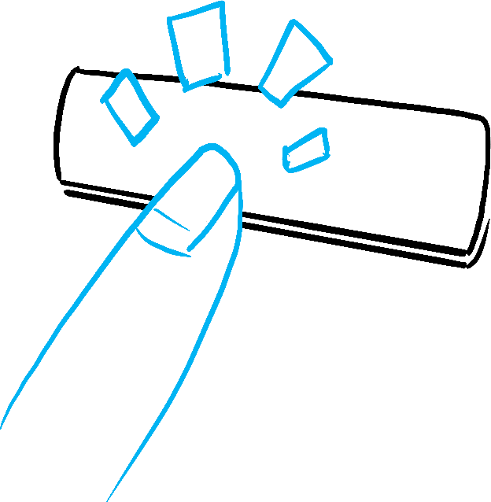
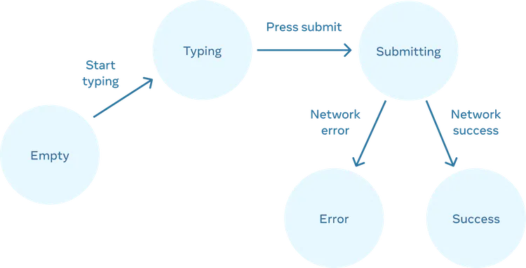

# REACT & NEXT JS NOTE 🚀

> A hand note of my react & next js journey.....

<br>
<div align="center">

| Key Note  |                      |           |                           |
| --------- | -------------------- | --------- | ------------------------- |
| **Emoji** | **Description**      | **Emoji** | **Description**           |
| 🌴        | **Main Topic**       | 🏷️        | **Regular Note**          |
| 🌿        | **Main Category**    | 📌        | **Regular Note**          |
| 🍃        | **Sub Category**     | 💎        | **High Value info**       |
| 🍂        | **Sub-sub Category** | ✋        | **Stop! check the point** |
| 🎈        | **Step**             | 🎯        | **Focus**                 |

</div>

<!-- NO COMMENT -->

## Table of Contents

[🌴 Module 1. Getting started with React: Describing the UI](#-)

- [🌿 1.1 Introduction to React](#)
- [🌿 1.2 React Installation & Development Env](#)
- [🌿 1.3 How React works: Virtual DOM](#)
- [🌿 C 01: Basics of React Components](#)
  - [🍃 1.4 Your first component](#-)
  - [🍃 1.5 Importing & Exporting Components](#-)
  - [🍃 1.6 Writing Markup with JSX](#-)
- [🌿 C 03: Managing State](#)
  - [🍃 3.1 Reacting to Input with State](#-)
  - [🍃 3.2 Choosing the State Structure](#-)

<br>

## 🌴 Module 1. Getting started with React: Describing the UI

## 🌿 1.1 Introduction to React

**Understanding the Vue instance, data, methods, computed properties, and lifecycle hooks.** <br>
The Vue instance is at the core of Vue.js and serves as the root of every Vue application. It's responsible for managing the data, methods, computed properties, and lifecycle hooks of your Vue components.<br>

```
var app = new Vue({
  // Options
});

```

## 🌿 1.2 React Installation & Development Env

\***\*Understanding the Vue instance, data, methods, computed properties, and lifecycle hooks.\*\*** <br>
The Vue instance is at the core of Vue.js and serves as the root of every Vue application. It's responsible for managing the data, methods, computed properties, and lifecycle hooks of your Vue components.<br>

```
var app = new Vue({
  // Options
});

```

<!-- Chapter : 1.4 ---------------------------------------------------------------------------------------->

<div align="center"><h2>🌿 Basics of React Components🌿</h2></div>

## 🍃 1.4 Your first component:

**🍂 1. Understanding Components in React**

Components are the core building blocks in React, combining HTML, CSS, and JavaScript into reusable UI elements. They enable the composition, ordering, and nesting of elements to create complete web pages or applications.

> কম্পোনেন্ট হলো- ইউজার ইন্টারফেস তৈরির ছোট্ট ছোট্ট ইট!

> রিয়্যাক্টে কম্পোনেন্ট বলতে আমরা বুঝি ইউজার ইন্টারফেসের ছোট্ট ছোট্ট ইট বা বিল্ডিং ব্লক। মনে করো তোমার ঘর। ঘর তৈরি করার জন্য তুমি কী কী ব্যবহার করো?

> ইট, বালু, সিমেন্ট - এগুলো হলো মূল উপাদান। তারপর এগুলো দিয়ে দরজা, জানালা, দেয়াল - আলাদা আলাদা অংশ তৈরি হয়। তারপর সব অংশ তৈরি হয়ে গেলে, একটি পুরা ঘর তৈরি হয়।

> রিয়্যাক্টেও ঠিক এমনই। জটিল ইউজার ইন্টারফেসগুলো ছোটো ছোটো কম্পোনেন্টগুলো দিয়ে তৈরি করা হয়।

> - React-এ, কম্পোনেন্টসমূহ হল UI তৈরির মূল ভিত্তি।
> - কম্পোনেন্ট দিয়ে আমরা HTML, CSS এবং JavaScript-কে একসাথে লিখতে পারি।
> - আপনি কম্পোনেন্ট তৈরি করে, যেমন <Post />, এবং সেগুলিকে ওয়েবসাইটের ভিন্ন ভিন্ন পেজে ব্যবহার করতে পারবেন। শুধু ডাটাগুলো ভিন্ন হবে।
> - React - এর ওপেন সোর্স কমুনিটি Chakari UI, Matarial UI হাজার হাজার Custom কম্পোনেন্ট অলরেডি তৈরি করেছে। আপনি চাইলে সেগুলিও আপনার সাইটে ব্যবহার করতে পারবেন।

> _রিয়্যাক্টে কম্পোনেন্টগুলো হলো ছোট্ট ছোট্ট ইট, যা একসাথে মিলে জটিল ইউজার ইন্টারফেস তৈরি করে। এগুলো পুনর্ব্যবহারযোগ্য এবং ডেটা-চালিত, যা রিয়্যাক্ট অ্যাপ্লিকেশনকে ম্যানেজ করা আরও সহজ করে তোলে।_

**Code:**

```
// Example of a simple component

export default function Profile() {
  return (
    
  );
}

```

```
<article>
  <h1>My First Component</h1>
  <ol>
    <li>Components: UI Building Blocks</li>
    <li>Defining a Component</li>
    <li>Using a Component</li>
  </ol>
</article>
```

> [!NOTE]\
> React lets you combine your markup, CSS, and JavaScript into custom “components”, reusable UI elements for your app.
> The table of contents code you saw above could be turned into a `<TableOfContents />` component you could render on every page. Under the hood, it still uses the same HTML tags like `<article>, <h1>` etc.

**🍂 2. Defining a Component**

- React components are JavaScript functions exported using export default. | a React component is a JavaScript function that you can sprinkle with markup.
- Component names must start with a capital letter and return JSX markup, which allows embedding HTML-like syntax in JavaScript.

**Code:**

```
// Example of defining a component
export default function Profile() {
  return (
    
  );
}

```

### Step 1: Export the component

The `export default` prefix is a standard JavaScript syntax (not specific to React). It lets you mark the main function in a file so that you can later import it from other files.

### Step 2: Define the function

With `function Profile() { }` you define a JavaScript function with the name `Profile`.

> [!NOTE]\
> React components are regular JavaScript functions, but **their names must start with a capital letter** or they won’t work!

### Step 3: Add markup

The component returns an `` tag with src and alt attributes. `` is written like HTML, but it is actually JavaScript under the hood! This syntax is called JSX, and it lets you embed markup inside JavaScript.

Return statements can be written all on one line, as in this component:

```
return ;

```

But if your markup isn’t all on the same line as the return keyword, you must wrap it in a pair of parentheses:

```
return (
  <div>
    
  </div>
);
```

> [!NOTE]\
> Without parentheses, any code on the lines after return _will be ignored!_

**🍂 3. Using Components**

- Components can be nested within other components.
- They render to HTML elements in the browser and can be organized within the same file or in separate files for modularity.

Now that you’ve defined your `Profile` component, you can nest it inside other components. For example, you can export a `Gallery` component that uses multiple `Profile` components:

Code:

```
// Example of using a component within another component
export default function Gallery() {
  return (
    <section>
      <h1>Amazing scientists</h1>
      <Profile />
      <Profile />
      <Profile />
    </section>
  );
}

```

**🍂 4. Best Practices and Pitfalls**

- Avoid defining components within other components for performance reasons.

```
export default function Gallery() {
  // 🔴 Never define a component inside another component!
  function Profile() {
    // ...
  }
  // ...
}

```

The snippet above is very slow and causes bugs. Instead, define every component at the top level:

```
export default function Gallery() {
  // ...
}

// ✅ Declare components at the top level
function Profile() {
  // ...
}

```

- Data should be passed from parent to child components through props rather than nesting definitions.

> [!NOTE]\
> **🏷️ Notes:**
> Remember, while components facilitate the creation of reusable UI elements, it's crucial to structure them wisely and adhere to best practices to maintain code quality and performance.

**🍂 5.What the browser sees**

Notice the difference in casing:

`<section>` is lowercase, so React knows we refer to an HTML tag.
`<Profile />` starts with a capital `P`, so React knows that we want to use our component called `Profile`.
And `Profile` contains even more HTML: ``. In the end, this is what the browser sees:

```
<section>
  <h1>Amazing scientists</h1>
  
  
  
</section>
```

**🍂 6. Deep Drive: Components all the way down**

Most React apps use components all the way down. This means that you won’t only use components for reusable pieces like buttons, but also for larger pieces like sidebars, lists, and ultimately, complete pages! Components are a handy way to organize UI code and markup, even if some of them are only used once.

React-based frameworks take this a step further. Instead of using an empty HTML file and letting React “take over” managing the page with JavaScript, they also generate the HTML automatically from your React components. This allows your app to show some content before the JavaScript code loads.

Still, many websites only use React to add interactivity to existing HTML pages. They have many root components instead of a single one for the entire page. You can use as much—or as little—React as you need.

> [!NOTE]\
> Few things need to memorize;
>
> - React lets you create components, reusable UI elements for your app.
> - In a React app, every piece of UI is a component.
> - React components are regular JavaScript functions except:
>   - Their names always begin with a capital letter.
>   - They return JSX markup.

সার সংক্ষেপ:

React আপনাকে কম্পোনেন্ট তৈরি করতে দেয়, যা আপনার অ্যাপের জন্য পুনর্ব্যবহারযোগ্য UI উপাদান।
একটি React অ্যাপে, প্রতিটি UI অংশই এক একটি কম্পোনেন্ট।
React কম্পোনেন্টসমূহ হল সাধারণ JavaScript ফাংশন, তবে এদের কিছু বিশেষ বৈশিষ্ট্য রয়েছে:
এদের নাম সবসময় বড় হাতের অক্ষর দিয়ে শুরু হয়।
এরা JSX মার্কআপ রিটার্ন করে।

<br>
<br>

<!-- Chapter : 1.5 ---------------------------------------------------------------------------------------->
<div align="center">🌿 Basics of React Components🌿</div>

## 🍃 1.5 Importing & Exporting Components

**🍂 1. Root Component and File Organization**

The root component file in React houses primary components. Organizing components into separate files enhances modularity and reusability.

**Code:**

```
// App.js - Root component

import Gallery from './Gallery.js';

export default function App() {
  return (
    <Gallery />
  );
}

```

**🍂 2. Exporting and Importing Components**

To modularize components:

- Make a new JS file to put the components in.
- Export your function component from that file (using either `default` or `named` exports).
- Import it in the file where you’ll use the component (using the corresponding technique for importing `default` or `named` exports).

**Code:**

```
// Gallery.js - Contains Profile (not exported) and Gallery (default export)

export default function Gallery() {
  // ... (uses Profile internally)
}

// App.js - Imports Gallery from Gallery.js
import Gallery from './Gallery.js';

export default function App() {
  return (
    <Gallery />
  );
}

```

> [!NOTE]\
> You may encounter files that leave off the .js file extension like so:

```
import Gallery from './Gallery';
```

> Either './Gallery.js' or './Gallery' will work with React, though the former is closer to how native ES Modules work.

**🍂 3. Default vs Named Exports | Deep Drive**

**A file can have no more than one default export,** but it can have as many named exports as you like.


**Code:**

```
// Gallery.js - Contains both default and named exports

export default function Gallery() {
  // ... (default export)
}

export function Profile() {
  // ... (named export)
}

// App.js - Imports both Gallery (default) and Profile (named) from Gallery.js

import Gallery, { Profile } from './Gallery.js';

export default function App() {
  return (
    <Profile />
  );
}

```

**🍂 4. Exporting Multiple Components**

Utilizing named exports allows exporting multiple components from a single file, enhancing flexibility in component usage across the application.

> How you export your component dictates how you must import it. You will get an error if you try to import a default export the same way you would a named export! This chart can help you keep track:


When you write a _default_ import, you can put any name you want after `import`. For example, you could write `import Banana from './Button.js'` instead and it would still provide you with the same default export. In contrast, _with named imports, the name has to match on both sides._ That’s why they are called named `imports!`

Code:

```
// Gallery.js - Contains Gallery (default) and Profile (named) exports

export default function Gallery() {
  // ...
}

export function Profile() {
  // ...
}

// App.js - Imports both Gallery (default) and Profile (named) from Gallery.

import Gallery, { Profile } from './Gallery.js';

export default function App() {
  return (
    <Profile />
  );
}

```

> [!NOTE]\
> Components without names, like export default () => {}, are discouraged because they make debugging harder.

> [!NOTE]\
> **Recap:**
> This section covered the root component, importing/exporting components, usage of default vs named exports, and exporting multiple components from a single file. It emphasized organizing components into separate files to enhance maintainability and reusability in React applications.

<br>
<br>
<!-- Chapter : 1.6 ------------------------------------------------------------------------------------------->
<div align="center">🌿Basics of React Components🌿</div>

## 🍃 1.6 Writing Markup with JSX

JSX is a syntax extension for JavaScript that lets you write HTML-like markup inside a JavaScript file. Although there are other ways to write components, most React developers prefer the conciseness of JSX, and most codebases use it.

**🍂 1. Understanding JSX in React**
JSX, a JavaScript syntax extension, enables the integration of HTML-like markup within JavaScript files in React. It's a preferred method due to its conciseness and co-location of rendering logic and markup.

> [!NOTE]\
>
> - JSX is a syntax extension for JavaScript, allowing HTML-like elements in React components.
> - Logic and markup coexist within components for easier synchronization during edits.

**🍂 2. JSX Rules and Differences from HTML**
JSX follows specific rules different from traditional HTML:

- Single Root Element: JSX requires a single parent tag to enclose multiple elements.
- Explicit Closing Tags: All tags must be explicitly closed (self-closing or with closing tags).
- camelCase Attributes: Attributes in JSX use camelCase, differing from HTML attributes.

Code:

```
// JSX example adhering to rules
<>
  <h1>Hedy Lamarr's Todos</h1>
  
  <ul>
    <li>Invent new traffic lights</li>
    <li>Rehearse a movie scene</li>
    <li>Improve the spectrum technology</li>
  </ul>
</>

```

**🍂 3. JSX vs. HTML: Differences and Conversion**

JSX closely resembles HTML but has a few distinctions in syntax and attribute naming conventions.
Converting HTML to JSX involves addressing these distinctions like single root elements, explicit closing tags, and camelCase attributes.

**💎💎 Pro-Tip:**
Using a converter can streamline the process of converting HTML to JSX, reducing the manual effort required.

> [!NOTE]\
> **💎💎 Recap:**

Understanding JSX's purpose in React and its differences from HTML is crucial for writing React components effectively. Following JSX rules ensures proper rendering and avoids errors within components. Using converters can aid in transitioning existing HTML to JSX for React components.

<!-- Chapter 03 ------------------------------------------------------------------------------------------------------------------------------>

## 🍃 3.1 Reacting to Input with State

React provides a declarative way to manipulate the UI. Instead of manipulating individual pieces of the UI directly, you describe the different states that your component can be in, and switch between them in response to the user input. This is similar to how designers think about the UI.

- Declarative programming means describing the UI for each visual state rather than micromanaging the UI (imperative).
- Imperative programming means you have to “command” each element, from the spinner to the button, telling the computer how to update the UI.

### 3.1.1 Thinking about UI declaratively

To better understand how to think in React, you’ll walk through reimplementing this UI in React below:

1. Identify your component’s different visual states
2. Determine what triggers those state changes
3. Represent the state in memory using useState
4. Remove any non-essential state variables
5. Connect the event handlers to set the state

### 3.1.1.1 Step 1: Identify your component’s different visual states

First, you need to visualize all the different “states” of the UI the user might see:

1. Empty: Form has a disabled “Submit” button.
2. Typing: Form has an enabled “Submit” button.
3. Submitting: Form is completely disabled. Spinner is shown.
4. Success: “Thank you” message is shown instead of a form.
5. Error: Same as Typing state, but with an extra error message.

Just like a designer, you’ll want to “mock up” or create “mocks” for the different states before you add logic. For example, here is a mock for just the visual part of the form. This mock is controlled by a prop called status with a default value of 'empty':

You could call that prop anything you like, the naming is not important. Try editing status = 'empty' to status = 'success' to see the success message appear. Mocking lets you quickly iterate on the UI before you wire up any logic. Here is a more fleshed out prototype of the same component, still “controlled” by the status prop:

```
export default function Form({
  // Try 'submitting', 'error', 'success':
  status = 'empty'
}) {
  if (status === 'success') {
    return <h1>That's right!</h1>
  }
  return (
    <>
      <h2>City quiz</h2>
      <p>
        In which city is there a billboard that turns air into drinkable water?
      </p>
      <form>
        <textarea disabled={
          status === 'submitting'
        } />
        <br />
        <button disabled={
          status === 'empty' ||
          status === 'submitting'
        }>
          Submit
        </button>
        {status === 'error' &&
          <p className="Error">
            Good guess but a wrong answer. Try again!
          </p>
        }
      </form>
      </>
  );
}
```

> [!NOTE]\
> **living styleguides” or “storybooks**
> If a component has a lot of visual states, it can be convenient to show them all on one page and this is called `living styleguides` or `storybooks`.

```
// App.jsx page ---------------------------------------------------------------

import Form from './Form.js';

let statuses = [
'empty',
'typing',
'submitting',
'success',
'error',
];

export default function App() {
return (
  <>
    {statuses.map(status => (
      <section key={status}>
        <h4>Form ({status}):</h4>
        <Form status={status} />
      </section>
    ))}
  </>
);
}

```

```
// Form.jsx page ---------------------------------------------------------------

export default function Form({ status }) {
  if (status === 'success') {
    return <h1>That's right!</h1>
  }
  return (
    <form>
      <textarea disabled={
        status === 'submitting'
      } />
      <br />
      <button disabled={
        status === 'empty' ||
        status === 'submitting'
      }>
        Submit
      </button>
      {status === 'error' &&
        <p className="Error">
          Good guess but a wrong answer. Try again!
        </p>
      }
    </form>
  );
}

```

> [!NOTE]\
> Summery

### Step 2: Determine what triggers those state changes

You can trigger state updates in response to two kinds of inputs:

- **Human inputs**, like clicking a button, typing in a field, navigating a link.
- **Computer inputs**, like a network response arriving, a timeout completing, an image loading.


<br>

In both cases, you must set `state variables` to update the UI. For the form you’re developing, you will need to change state in response to a few different inputs:

- **Changing the text input (human)** should switch it from the Empty state to the Typing state or back, depending on whether the text box is empty or not.
- **Clicking the Submit button (human)** should switch it to the Submitting state.
- **Successful network response (computer)** should switch it to the Success state.
- **Failed network response (computer)** should switch it to the Error state with the matching error message.

> [!NOTE]\
> Notice that human inputs often require `event handlers`!

To help visualize this flow, try drawing each state on paper as a labeled circle, and each change between two states as an arrow. You can sketch out many flows this way and sort out bugs long before implementation.


<div align="center"><h2>Form states</h2></div>

> [!NOTE]\
> Summery <br>
> Just check your app, what area or portion will triggers. If triggers need then must have to add the change in the state, what ever it from human or machine by automatic.

## Step 3: Represent the state in memory with `useState`

Next you’ll need to represent the visual states of your component in memory with `useState`.

> [!IMPORTANT]\
> Simplicity is key: <br>
> each piece of state is a “moving piece”, and you want as few “moving pieces” as possible. More complexity leads to more bugs!

<h6>STEP 01:</h6> 
Start with the state that absolutely must be there. For example, you’ll need to store the answer for the input, and the error (if it exists) to store the last error:

```
const [answer, setAnswer] = useState('');
const [error, setError] = useState(null);

```

<h6>STEP 02:</h6> 
Then, you’ll need a state variable representing which one of the visual states that you want to display. There’s usually more than a single way to represent that in memory, so you’ll need to experiment with it.

If you struggle to think of the best way immediately, start by adding enough state that you’re definitely sure that all the possible visual states are covered:

```
const [isEmpty, setIsEmpty] = useState(true);
const [isTyping, setIsTyping] = useState(false);
const [isSubmitting, setIsSubmitting] = useState(false);
const [isSuccess, setIsSuccess] = useState(false);
const [isError, setIsError] = useState(false);
```

> [!NOTE]\
> Your first idea likely won’t be the best, but that’s ok—refactoring state is a part of the process!

> [!NOTE]\
> Summery <br>
> Find out all possible `states` and make a list.

## Step 4: Remove any non-essential state variables

- you never want to show an error message and disable the input at the same time, or the user won’t be able to correct the error!
- You want to avoid duplication in the state content so you’re only tracking what is essential.
- Your goal is to prevent the cases where the state in memory doesn’t represent any valid UI that you’d want a user to see.

Here are some questions you can ask about your state variables:

- Does this state cause a paradox?
  For example, `isTyping` and `isSubmitting` can’t both be true. A paradox usually means that the state is not constrained enough. There are four possible combinations of two booleans, but only three correspond to valid `states`. To remove the “impossible” state, you can combine these into a status that must be one of three values: `'typing'`, `'submitting'`, or `'success'`.
- Is the same information available in another state variable already?
  Another paradox: `isEmpty` and `isTyping` can’t be true at the same time. By making them separate state variables, you risk them going out of sync and causing bugs. Fortunately, you can remove `isEmpty` and instead check `answer.length === 0`.
- Can you get the same information from the inverse of another state variable?
  `isError` is not needed because you can check error `!== null` instead.

After this clean-up, you’re left with 3 (down from 7!) essential state variables:

```
const [answer, setAnswer] = useState('');
const [error, setError] = useState(null);
const [status, setStatus] = useState('typing'); // 'typing', 'submitting', or 'success'

```

> [!NOTE]\
> Summery <br>
> Ask Q \_ Does this state cause a paradox? | Is the same information available in another state variable already? | Can you get the same information from the inverse of another state variable?
> By this you can reduce unnecessary stauts.

## Step 5: Connect the event handlers to set state

Lastly, create event handlers that update the state. Below is the final form, with all event handlers wired up:

```
import { useState } from 'react';

export default function Form() {
  const [answer, setAnswer] = useState('');
  const [error, setError] = useState(null);
  const [status, setStatus] = useState('typing');

  if (status === 'success') {
    return <h1>That's right!</h1>
  }

  async function handleSubmit(e) {
    e.preventDefault();
    setStatus('submitting');
    try {
      await submitForm(answer);
      setStatus('success');
    } catch (err) {
      setStatus('typing');
      setError(err);
    }
  }

  function handleTextareaChange(e) {
    setAnswer(e.target.value);
  }

  return (
    <>
      <h2>City quiz</h2>
      <p>
        In which city is there a billboard that turns air into drinkable water?
      </p>
      <form onSubmit={handleSubmit}>
        <textarea
          value={answer}
          onChange={handleTextareaChange}
          disabled={status === 'submitting'}
        />
        <br />
        <button disabled={
          answer.length === 0 ||
          status === 'submitting'
        }>
          Submit
        </button>
        {error !== null &&
          <p className="Error">
            {error.message}
          </p>
        }
      </form>
    </>
  );
}

function submitForm(answer) {
  // Pretend it's hitting the network.
  return new Promise((resolve, reject) => {
    setTimeout(() => {
      let shouldError = answer.toLowerCase() !== 'lima'
      if (shouldError) {
        reject(new Error('Good guess but a wrong answer. Try again!'));
      } else {
        resolve();
      }
    }, 1500);
  });
}

```

### Recap

- eclarative programming means describing the UI for each visual state rather than micromanaging the UI (imperative).
- When developing a component:

1.  Identify all its visual states.
2.  Determine the human and computer triggers for state changes.
3.  Model the state with useState.
4.  Remove non-essential state to avoid bugs and paradoxes.
5.  Connect the event handlers to set state.

## 🍃 3.2 Choosing the State Structure

### Principles for structuring state

The goal behind these principles is to make state easy to update without introducing mistakes. Removing redundant and duplicate data from state helps ensure that all its pieces stay in sync. This is similar to how a database engineer might want to “normalize” the database structure to reduce the chance of bugs.

While it’s possible to write correct programs even with a suboptimal state structure, there are a few principles that can guide you to make better choices:

1. Group related state. If you always update two or more state variables at the same time, consider merging them into a single state variable.
2. Avoid contradictions in state. When the state is structured in a way that several pieces of state may contradict and “disagree” with each other, you leave room for mistakes. Try to avoid this.
3. Avoid redundant state. If you can calculate some information from the component’s props or its existing state variables during rendering, you should not put that information into that component’s state.
4. Avoid duplication in state. When the same data is duplicated between multiple state variables, or within nested objects, it is difficult to keep them in sync. Reduce duplication when you can.
5. Avoid deeply nested state. Deeply hierarchical state is not very convenient to update. When possible, prefer to structure state in a flat way.

### 1. Group related state

We sould skip same type multiple state if it can marge in one.

```
const [x, setX] = useState(0);
const [y, setY] = useState(0);
```

Rather, if some two state variables always change together, it might be a good idea to unify them into a single state variable.

```
const [position, setPosition] = useState(
  {
    x: 0,
    y: 0
  }
  );
```

> [!NOTE]\
> Pitfall
> If your state variable is an object, remember that you can’t update only one field in it without explicitly copying the other fields. For example, you can’t do `setPosition({ x: 100 })` in the above example because it would not have the y property at all! Instead, if you wanted to set x alone, you would either do `setPosition({ ...position, x: 100 })`, or split them into two state variables and do `setX(100)`.
> মানে যখন একাধিক স্টেট কে আমরা একটিতে নিতে আসবো। আমাদের কিন্তু একই সাথে তা আপডেট করতে হবে। যদি আমরা কোন একটি কে `sync` না করি তবে আমরা স্টেট থেকে তা কপি করে নিব। ...value1

## Avoid contradictions in state

- Read Documentation .

## Avoid redundant state

> redundant_অপ্রয়োজনীয়

- Read Documentation .

## Avoid duplication in state

- [https://react.dev/learn/choosing-the-state-structure#avoid-duplication-in-state]Read Documentation .

## Avoid deeply nested state

[! Read Documentation ](https://react.dev/learn/choosing-the-state-structure#avoid-duplication-in-state).

Recap

- If two state variables always update together, consider merging them into one.
- Choose your state variables carefully to avoid creating “impossible” states.
- Structure your state in a way that reduces the chances that you’ll make a mistake updating it.
- Avoid redundant and duplicate state so that you don’t need to keep it in sync.
- Don’t put props into state unless you specifically want to prevent updates.
- For UI patterns like selection, keep ID or index in state instead of the object itself.
- If updating deeply nested state is complicated, try flattening it.
