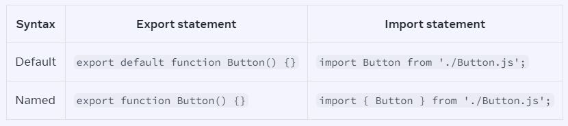

# REACT & NEXT JS NOTE 🚀

> A hand note of my react & next js journey.....

<br>
<div align="center">

| Key Note  |                      |           |                           |
| --------- | -------------------- | --------- | ------------------------- |
| **Emoji** | **Description**      | **Emoji** | **Description**           |
| 🌴        | **Main Topic**       | 🏷️        | **Regular Note**          |
| 🌿        | **Main Category**    | 📌        | **Regular Note**          |
| 🍃        | **Sub Category**     | 💎        | **High Value info**       |
| 🍂        | **Sub-sub Category** | ✋        | **Stop! check the point** |
| 🎈        | **Step**             | 🎯        | **Focus**                 |

</div>

<!-- NO COMMENT -->

## Table of Contents

[🌴 Module 1. Getting started with React: Describing the UI](#-)

- [🌿 1.1 Introduction to React](#)
- [🌿 1.2 React Installation & Development Env](#)
- [🌿 1.3 How React works: Virtual DOM](#)
- [🌿 Basics of React Components](#)
  - [🍃 1.4 Your first component](#-)
  - [🍃 1.5 Importing & Exporting Components](#-)
  - [🍃 1.6 Writing Markup with JSX](#-)

<br>

## 🌴 Module 1. Getting started with React: Describing the UI

## 🌿 1.1 Introduction to React

**Understanding the Vue instance, data, methods, computed properties, and lifecycle hooks.** <br>
The Vue instance is at the core of Vue.js and serves as the root of every Vue application. It's responsible for managing the data, methods, computed properties, and lifecycle hooks of your Vue components.<br>

```
var app = new Vue({
  // Options
});

```

## 🌿 1.2 React Installation & Development Env

\***\*Understanding the Vue instance, data, methods, computed properties, and lifecycle hooks.\*\*** <br>
The Vue instance is at the core of Vue.js and serves as the root of every Vue application. It's responsible for managing the data, methods, computed properties, and lifecycle hooks of your Vue components.<br>

```
var app = new Vue({
  // Options
});

```

<!-- Chapter : 1.4 ---------------------------------------------------------------------------------------->

<div align="center"><h2>🌿 Basics of React Components🌿</h2></div>

## 🍃 1.4 Your first component:

**🍂 1. Understanding Components in React**

Components are the core building blocks in React, combining HTML, CSS, and JavaScript into reusable UI elements. They enable the composition, ordering, and nesting of elements to create complete web pages or applications.

> কম্পোনেন্ট হলো- ইউজার ইন্টারফেস তৈরির ছোট্ট ছোট্ট ইট!

> রিয়্যাক্টে কম্পোনেন্ট বলতে আমরা বুঝি ইউজার ইন্টারফেসের ছোট্ট ছোট্ট ইট বা বিল্ডিং ব্লক। মনে করো তোমার ঘর। ঘর তৈরি করার জন্য তুমি কী কী ব্যবহার করো?

> ইট, বালু, সিমেন্ট - এগুলো হলো মূল উপাদান। তারপর এগুলো দিয়ে দরজা, জানালা, দেয়াল - আলাদা আলাদা অংশ তৈরি হয়। তারপর সব অংশ তৈরি হয়ে গেলে, একটি পুরা ঘর তৈরি হয়।

> রিয়্যাক্টেও ঠিক এমনই। জটিল ইউজার ইন্টারফেসগুলো ছোটো ছোটো কম্পোনেন্টগুলো দিয়ে তৈরি করা হয়।

> - React-এ, কম্পোনেন্টসমূহ হল UI তৈরির মূল ভিত্তি।
> - কম্পোনেন্ট দিয়ে আমরা HTML, CSS এবং JavaScript-কে একসাথে লিখতে পারি।
> - আপনি কম্পোনেন্ট তৈরি করে, যেমন <Post />, এবং সেগুলিকে ওয়েবসাইটের ভিন্ন ভিন্ন পেজে ব্যবহার করতে পারবেন। শুধু ডাটাগুলো ভিন্ন হবে।
> - React - এর ওপেন সোর্স কমুনিটি Chakari UI, Matarial UI হাজার হাজার Custom কম্পোনেন্ট অলরেডি তৈরি করেছে। আপনি চাইলে সেগুলিও আপনার সাইটে ব্যবহার করতে পারবেন।

> _রিয়্যাক্টে কম্পোনেন্টগুলো হলো ছোট্ট ছোট্ট ইট, যা একসাথে মিলে জটিল ইউজার ইন্টারফেস তৈরি করে। এগুলো পুনর্ব্যবহারযোগ্য এবং ডেটা-চালিত, যা রিয়্যাক্ট অ্যাপ্লিকেশনকে ম্যানেজ করা আরও সহজ করে তোলে।_

**Code:**

```
// Example of a simple component

export default function Profile() {
  return (
    
  );
}

```

```
<article>
  <h1>My First Component</h1>
  <ol>
    <li>Components: UI Building Blocks</li>
    <li>Defining a Component</li>
    <li>Using a Component</li>
  </ol>
</article>
```

> [!NOTE]\
> React lets you combine your markup, CSS, and JavaScript into custom “components”, reusable UI elements for your app.
> The table of contents code you saw above could be turned into a `<TableOfContents />` component you could render on every page. Under the hood, it still uses the same HTML tags like `<article>, <h1>` etc.

**🍂 2. Defining a Component**

- React components are JavaScript functions exported using export default. | a React component is a JavaScript function that you can sprinkle with markup.
- Component names must start with a capital letter and return JSX markup, which allows embedding HTML-like syntax in JavaScript.

**Code:**

```
// Example of defining a component
export default function Profile() {
  return (
    
  );
}

```

### Step 1: Export the component

The `export default` prefix is a standard JavaScript syntax (not specific to React). It lets you mark the main function in a file so that you can later import it from other files.

### Step 2: Define the function

With `function Profile() { }` you define a JavaScript function with the name `Profile`.

> [!NOTE]\
> React components are regular JavaScript functions, but **their names must start with a capital letter** or they won’t work!

### Step 3: Add markup

The component returns an `` tag with src and alt attributes. `` is written like HTML, but it is actually JavaScript under the hood! This syntax is called JSX, and it lets you embed markup inside JavaScript.

Return statements can be written all on one line, as in this component:

```
return ;

```

But if your markup isn’t all on the same line as the return keyword, you must wrap it in a pair of parentheses:

```
return (
  <div>
    
  </div>
);
```

> [!NOTE]\
> Without parentheses, any code on the lines after return _will be ignored!_

**🍂 3. Using Components**

- Components can be nested within other components.
- They render to HTML elements in the browser and can be organized within the same file or in separate files for modularity.

Now that you’ve defined your `Profile` component, you can nest it inside other components. For example, you can export a `Gallery` component that uses multiple `Profile` components:

Code:

```
// Example of using a component within another component
export default function Gallery() {
  return (
    <section>
      <h1>Amazing scientists</h1>
      <Profile />
      <Profile />
      <Profile />
    </section>
  );
}

```

**🍂 4. Best Practices and Pitfalls**

- Avoid defining components within other components for performance reasons.

```
export default function Gallery() {
  // 🔴 Never define a component inside another component!
  function Profile() {
    // ...
  }
  // ...
}

```

The snippet above is very slow and causes bugs. Instead, define every component at the top level:

```
export default function Gallery() {
  // ...
}

// ✅ Declare components at the top level
function Profile() {
  // ...
}

```

- Data should be passed from parent to child components through props rather than nesting definitions.

> [!NOTE]\
> **🏷️ Notes:**
> Remember, while components facilitate the creation of reusable UI elements, it's crucial to structure them wisely and adhere to best practices to maintain code quality and performance.

**🍂 5.What the browser sees**

Notice the difference in casing:

`<section>` is lowercase, so React knows we refer to an HTML tag.
`<Profile />` starts with a capital `P`, so React knows that we want to use our component called `Profile`.
And `Profile` contains even more HTML: ``. In the end, this is what the browser sees:

```
<section>
  <h1>Amazing scientists</h1>
  
  
  
</section>
```

**🍂 6. Deep Drive: Components all the way down**

Most React apps use components all the way down. This means that you won’t only use components for reusable pieces like buttons, but also for larger pieces like sidebars, lists, and ultimately, complete pages! Components are a handy way to organize UI code and markup, even if some of them are only used once.

React-based frameworks take this a step further. Instead of using an empty HTML file and letting React “take over” managing the page with JavaScript, they also generate the HTML automatically from your React components. This allows your app to show some content before the JavaScript code loads.

Still, many websites only use React to add interactivity to existing HTML pages. They have many root components instead of a single one for the entire page. You can use as much—or as little—React as you need.

> [!NOTE]\
> Few things need to memorize;
>
> - React lets you create components, reusable UI elements for your app.
> - In a React app, every piece of UI is a component.
> - React components are regular JavaScript functions except:
>   - Their names always begin with a capital letter.
>   - They return JSX markup.

সার সংক্ষেপ:

React আপনাকে কম্পোনেন্ট তৈরি করতে দেয়, যা আপনার অ্যাপের জন্য পুনর্ব্যবহারযোগ্য UI উপাদান।
একটি React অ্যাপে, প্রতিটি UI অংশই এক একটি কম্পোনেন্ট।
React কম্পোনেন্টসমূহ হল সাধারণ JavaScript ফাংশন, তবে এদের কিছু বিশেষ বৈশিষ্ট্য রয়েছে:
এদের নাম সবসময় বড় হাতের অক্ষর দিয়ে শুরু হয়।
এরা JSX মার্কআপ রিটার্ন করে।

<br>
<br>

<!-- Chapter : 1.5 ---------------------------------------------------------------------------------------->
<div align="center">🌿 Basics of React Components🌿</div>

## 🍃 1.5 Importing & Exporting Components

**🍂 1. Root Component and File Organization**

The root component file in React houses primary components. Organizing components into separate files enhances modularity and reusability.

**Code:**

```
// App.js - Root component

import Gallery from './Gallery.js';

export default function App() {
  return (
    <Gallery />
  );
}

```

**🍂 2. Exporting and Importing Components**

To modularize components:

- Make a new JS file to put the components in.
- Export your function component from that file (using either `default` or `named` exports).
- Import it in the file where you’ll use the component (using the corresponding technique for importing `default` or `named` exports).

**Code:**

```
// Gallery.js - Contains Profile (not exported) and Gallery (default export)

export default function Gallery() {
  // ... (uses Profile internally)
}

// App.js - Imports Gallery from Gallery.js
import Gallery from './Gallery.js';

export default function App() {
  return (
    <Gallery />
  );
}

```

> [!NOTE]\
> You may encounter files that leave off the .js file extension like so:

```
import Gallery from './Gallery';
```

> Either './Gallery.js' or './Gallery' will work with React, though the former is closer to how native ES Modules work.

**🍂 3. Default vs Named Exports | Deep Drive**

**A file can have no more than one default export,** but it can have as many named exports as you like.


**Code:**

```
// Gallery.js - Contains both default and named exports

export default function Gallery() {
  // ... (default export)
}

export function Profile() {
  // ... (named export)
}

// App.js - Imports both Gallery (default) and Profile (named) from Gallery.js

import Gallery, { Profile } from './Gallery.js';

export default function App() {
  return (
    <Profile />
  );
}

```

**🍂 4. Exporting Multiple Components**

Utilizing named exports allows exporting multiple components from a single file, enhancing flexibility in component usage across the application.

> How you export your component dictates how you must import it. You will get an error if you try to import a default export the same way you would a named export! This chart can help you keep track:



When you write a _default_ import, you can put any name you want after `import`. For example, you could write `import Banana from './Button.js'` instead and it would still provide you with the same default export. In contrast, _with named imports, the name has to match on both sides._ That’s why they are called named `imports!`

Code:

```
// Gallery.js - Contains Gallery (default) and Profile (named) exports

export default function Gallery() {
  // ...
}

export function Profile() {
  // ...
}

// App.js - Imports both Gallery (default) and Profile (named) from Gallery.

import Gallery, { Profile } from './Gallery.js';

export default function App() {
  return (
    <Profile />
  );
}

```

> [!NOTE]\
> Components without names, like export default () => {}, are discouraged because they make debugging harder.

> [!NOTE]\
> **Recap:**
> This section covered the root component, importing/exporting components, usage of default vs named exports, and exporting multiple components from a single file. It emphasized organizing components into separate files to enhance maintainability and reusability in React applications.

<br>
<br>
<!-- Chapter : 1.6 ------------------------------------------------------------------------------------------->
<div align="center">🌿Basics of React Components🌿</div>

## 🍃 1.6 Writing Markup with JSX

JSX is a syntax extension for JavaScript that lets you write HTML-like markup inside a JavaScript file. Although there are other ways to write components, most React developers prefer the conciseness of JSX, and most codebases use it.

**🍂 1. Understanding JSX in React**
JSX, a JavaScript syntax extension, enables the integration of HTML-like markup within JavaScript files in React. It's a preferred method due to its conciseness and co-location of rendering logic and markup.

> [!NOTE]\
>
> - JSX is a syntax extension for JavaScript, allowing HTML-like elements in React components.
> - Logic and markup coexist within components for easier synchronization during edits.

**🍂 2. JSX Rules and Differences from HTML**
JSX follows specific rules different from traditional HTML:

- Single Root Element: JSX requires a single parent tag to enclose multiple elements.
- Explicit Closing Tags: All tags must be explicitly closed (self-closing or with closing tags).
- camelCase Attributes: Attributes in JSX use camelCase, differing from HTML attributes.

Code:

```
// JSX example adhering to rules
<>
  <h1>Hedy Lamarr's Todos</h1>
  
  <ul>
    <li>Invent new traffic lights</li>
    <li>Rehearse a movie scene</li>
    <li>Improve the spectrum technology</li>
  </ul>
</>

```

**🍂 3. JSX vs. HTML: Differences and Conversion**

JSX closely resembles HTML but has a few distinctions in syntax and attribute naming conventions.
Converting HTML to JSX involves addressing these distinctions like single root elements, explicit closing tags, and camelCase attributes.

**💎💎 Pro-Tip:**
Using a converter can streamline the process of converting HTML to JSX, reducing the manual effort required.

> [!NOTE]\
> **💎💎 Recap:**

Understanding JSX's purpose in React and its differences from HTML is crucial for writing React components effectively. Following JSX rules ensures proper rendering and avoids errors within components. Using converters can aid in transitioning existing HTML to JSX for React components.
